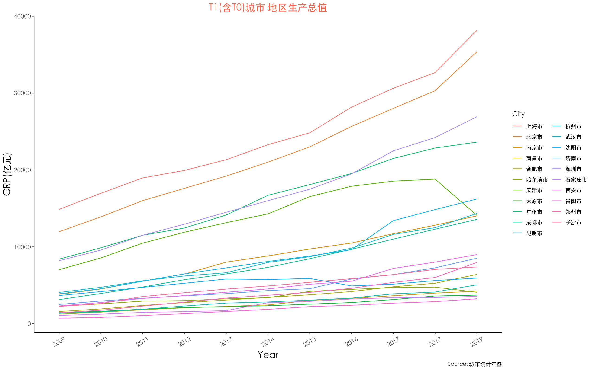
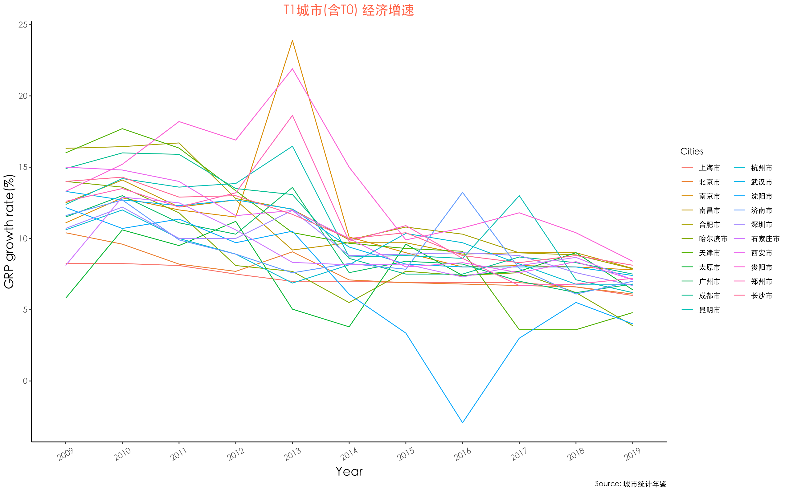
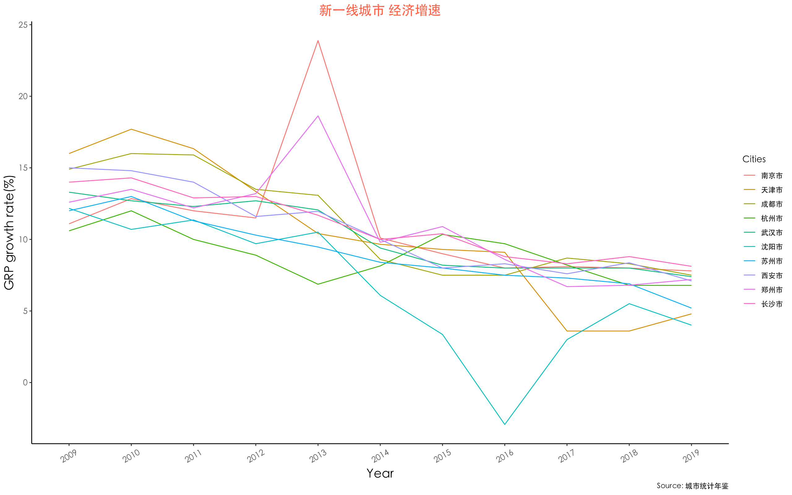
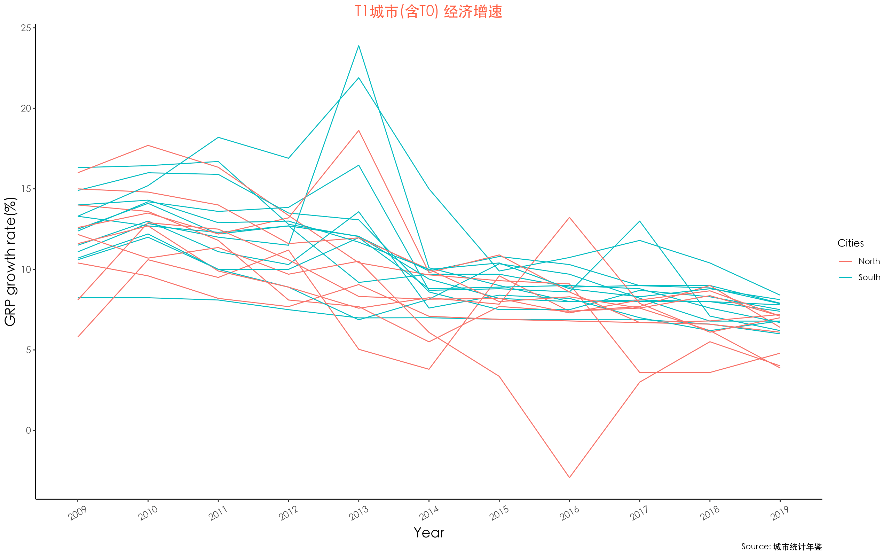

  

从经济增长的角度，哪些城市具有潜力？

猛一看像是一句废话,但这是一个值得拿事实讲道理的问题。如果考虑回国发展，城市的潜力、平台，和个人息息相关。何况人不能干出1949年加入国军的事情。对于海龟，选项其实逃不出一线和省会城市，包括作为超一线（我管他们叫T0）的北上广深，还有一线、准一线的省会发达城市（T1）。毕竟全世界的大农村，还是欧美香。

要比国内的城市，那就简单地从地区生产总值（GRP, gross regional product）看经济发达程度。这个指标可以简单理解为“一个城市的GDP”。选出T0和部分有兴趣的T1城市，首先从经济总量上看:

 
全国经济还在增长，除了个别城市，大趋势依然是蛋糕在做大。如果放到人均生产总值（per GRP）来看，趋势也差不多[^1]。这符合过去十年最朴素的感受与认知。T0城市一骑绝尘，一部分T1城市像是苏州、成都也很抢眼。而如果我们关心的是一个城市的未来，那么最简单的就是看经济增速（growth rate）和这个增速的增速/趋势（a second order problem）。有意思的事情马上开始出现了。

[^1]:然而2013年统计数字显然有问题，13年人均产值异常起跳，并且这个问题从总GRP上看不出来，应该是总产值与人口统计的除法出了问题，甚至可以说误差还不小。加上“人均”这个东西，其实很难说有多大参考价值，所以我们还是从总量上看变化。

首先过去十年，一线和超一线城市的经济增速都是非常惊人的，基本订在了7%-15%，是远高于现在6%左右的GDP growth rate，在早些年更是远超曾经的“保8”水平。这并不意外，这些一线城市在国民经济中起到了带头作用。即使按5%看，这个数字也是很惊人的，要知道美国的增速长年保持在3%左右，而且是如此庞大的巨轮持续长跑。

第二，经济减速早已成为大背景。如果把超一线的北上广深（T0城市）拿掉，这个趋势只会更加明显。2020年的疫情影响，只会是这个趋势里的借坡下驴。下图就选取了这些城市里被称为“新一线”的、发展较好的城市[^2]作为例子。早在2014年，我朝就提出了中国经济进入“新常态”—— “经济增长速度从高速降为中高速”、“经济结构（城乡区域差距、经济产业结构）优化”和“增长动力由投资转为创新”。现在回头来看，我国对经济趋势的判断和把握，还是比较敏锐的。包括后来不断提到的经济“软着陆”都是基于对这个大趋势的认识。

但是这里我们只关心第一点，并且从城市这个相对微观一点的视角，我们直观的看到了这个减速。当蛋糕做不大、开始专注切蛋糕的时候，社会流动性和上升通道也可能会渐渐固化。

[^2]:主要一些年轻人感兴趣的包括杭州,苏州,成都，南京，武汉,南京等城市

第三，南北差异。如果就按照“秦岭-淮河”的南北二分，将这些城市分为两组，另一个曾被激烈讨论的事实出现在眼前：南强北弱。在整体经济减速的大背景下，北方更沉淀在下层部分。

其实从国家每年的“新一线”城市名单里就能看出这个趋势。再比如，从星巴克门店数量、从年轻人喜欢的城市，虽然这些细节不能代表全部，但真相与现实就藏在这些细节里。 对国家来说，这是需要重视与思考的问题：除了东部与西部的差异，现在南北也出现分化和虹吸效应。

对个人来讲，事情就没那么复杂了。先有的选，然后哪里待遇好，买得起房，心里呆着舒服，人就往哪里去。和一些熟悉的小伙伴聊，如果回国，大家基本的共识是去南方。作为T0的北上广深最大的问题就是房价，而T1特别是新一线的南方城市如杭州、成都、南京，只要有合适的职位，其实都非常适合。

当然如果不回国，那也不会意外。毕竟制度套利这种事情，有多少人会说“不”呢。总结起来也就一句话：“他们给的实在是太多了。”
